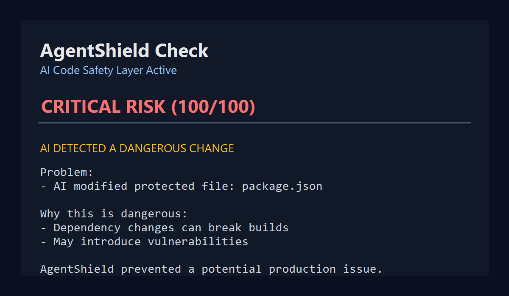
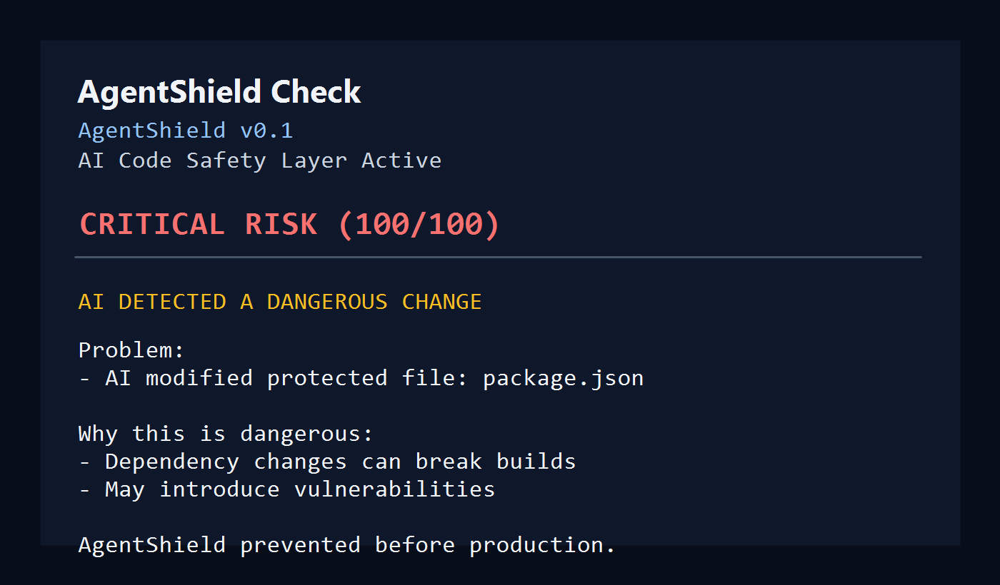

# 🛡️ AgentShield
 ## 🚨 Real AI Failure (Caught by AgentShield)

AI modified `package.json` without context.

🚨 CRITICAL RISK (100/100)

This could:
- break builds
- introduce vulnerabilities

🛡️ AgentShield stopped it before commit.
## 🚨 Your AI writes code. We make sure it doesn’t destroy your project.

AI coding tools move fast. Sometimes too fast.

AgentShield is a local CLI and VS Code safety layer for developers using AI coding agents. It scans git changes, detects risky AI behavior, protects critical files, and explains what could break before you commit.

Built for solo developers, startup teams, and production codebases where an unexpected AI edit can become a real incident.

[](https://github.com/sametdlkrn/AgentShield/actions/workflows/ci.yml)
[](LICENSE)
[](package.json)

━━━━━━━━━━━━━━━━━━━━━━━

## 🔥 What AgentShield Does

- Detects dangerous AI changes before commit
- Protects critical files like `.env`, auth, payments, and config
- Prevents hidden dependency risks in `package.json` and lockfiles
- Explains why a change is risky in plain English
- Warns when AI edits files outside the assigned agent scope
- Keeps everything local first: no cloud, no API key, no backend

━━━━━━━━━━━━━━━━━━━━━━━

## ⚠️ Real Example

```bash
AgentShield Check

🛡️ AgentShield v0.1
AI Code Safety Layer Active

🚨 CRITICAL RISK (100/100)
Allowed: MEDIUM

━━━━━━━━━━━━━━━━━━━

⚠️ AI DETECTED A DANGEROUS CHANGE

Problem:
- AI modified protected file: package.json

Why this is dangerous:
- Dependency changes can break builds
- May introduce vulnerabilities

What you should do:
- Run: agentshield explain
- Review changes before commit

━━━━━━━━━━━━━━━━━━━

🛡️ AgentShield prevented a potential production issue.
```

━━━━━━━━━━━━━━━━━━━━━━━

## 📸 Visuals

> Screenshot placeholder: AgentShield CLI detecting a dangerous dependency change.



> Screenshot placeholder: AgentShield VS Code sidebar showing risk, changed files, and protected warnings.



Real terminal output from AgentShield catching an unsafe AI change.

━━━━━━━━━━━━━━━━━━━━━━━

## ⚡ Quick Start

```bash
npm install
npm run build
npm link

agentshield init
agentshield scan
agentshield check
```

━━━━━━━━━━━━━━━━━━━━━━━

## 🧪 Example Workflow

Windows PowerShell:

```powershell
git init
echo SECRET=123 > .env
git add .
git commit -m "init"

echo SECRET=HACKED > .env

agentshield check
```

macOS/Linux:

```bash
git init
touch .env
echo "SECRET=123" > .env
git add .
git commit -m "init"

echo "SECRET=HACKED" > .env

agentshield check
```

AgentShield will flag the `.env` change because AI-modified environment files can break deployments or expose secrets.

━━━━━━━━━━━━━━━━━━━━━━━

## 💡 Why This Exists

AI tools are excellent at writing code. They are not always excellent at respecting project boundaries.

They can modify unrelated files, change dependencies, rewrite auth logic, touch payment flows, or silently alter deployment configuration. Developers need a safety layer that reviews AI changes before those changes become commits.

AgentShield solves this with deterministic local checks, clear risk scoring, and human-readable explanations.

━━━━━━━━━━━━━━━━━━━━━━━

## 🎯 Positioning

Cursor writes code.

Copilot suggests code.

AgentShield protects your project from AI mistakes.

━━━━━━━━━━━━━━━━━━━━━━━
## 👨‍💻 Who is this for?

- Developers using Cursor / Copilot / Codex
- Indie hackers building fast with AI
- Startups relying on AI-assisted coding
## 🔒 Use Cases

- Solo developers using AI coding agents
- Startup teams shipping fast with AI assistance
- Production systems with auth, payments, or secrets
- CI protection for risky AI-generated diffs
- Teams coordinating multiple agents in the same repository

━━━━━━━━━━━━━━━━━━━━━━━

## 🧰 CLI Commands

```bash
agentshield init
agentshield scan
agentshield update-context
agentshield check
agentshield check --json
agentshield check --fail-on-risk
agentshield explain
agentshield revert-unrelated
agentshield doctor
agentshield task create --agent codex --scope "UI work" --files "src/ui/**"
agentshield task list
agentshield task complete TASK-20260425120000
```

━━━━━━━━━━━━━━━━━━━━━━━

## ⚙️ Configuration

`agentshield.config.json`:

```json
{
  "protectedPaths": [
    ".env",
    "package.json",
    "src/auth/**",
    "src/payments/**",
    "firebase.rules"
  ],
  "ignorePaths": [
    "node_modules/**",
    ".git/**",
    "dist/**",
    "build/**",
    ".next/**"
  ],
  "allowedRiskLevel": "MEDIUM"
}
```

Ignored paths are removed from affected files, scoring, and explanations.

━━━━━━━━━━━━━━━━━━━━━━━

## 💻 VS Code

Build and install the local extension:

```bash
npm run vscode:install
```

Open VS Code and select the AgentShield shield icon. The sidebar shows:

- current risk score
- changed files
- protected file warnings
- active AI task locks
- scan, check, update context, and explain buttons

━━━━━━━━━━━━━━━━━━━━━━━

## 🚀 Roadmap

- Cloud sync
- Team policies
- Real-time guard mode
- GitHub Action wrapper
- Pull request comments
- Cloud dashboard

━━━━━━━━━━━━━━━━━━━━━━━

## 🧠 Philosophy

AI should accelerate development, not introduce hidden risk.

━━━━━━━━━━━━━━━━━━━━━━━
## ⚡ Why AgentShield matters

AI tools are fast.

But they:
- change things silently
- break working code
- introduce hidden risks

AgentShield adds a safety layer between AI and your production code.
## 💰 Future Plans

AgentShield is local-first today. Future plans may include:

- team plans
- cloud dashboard
- CI integration
- organization policies
- audit history

━━━━━━━━━━━━━━━━━━━━━━━

## 🛠️ Development

```bash
npm install
npm run build
npm test
npm run check
```

## License

MIT
