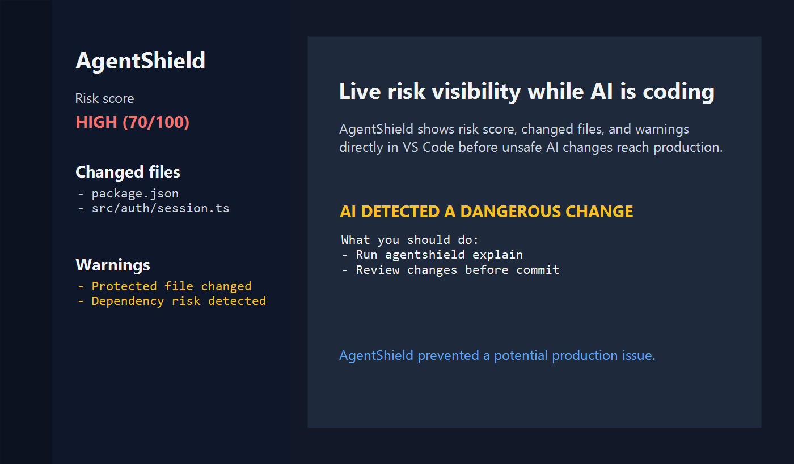

# 🛡️ AgentShield

## 🚨 Your AI writes code. We make sure it doesn’t destroy your project.

AI coding tools are fast, but they can silently break working code, modify critical files, or introduce hidden risks.

AgentShield detects and explains dangerous AI changes before they reach production.

[](https://github.com/sametdlkrn/AgentShield/actions/workflows/ci.yml)
[](LICENSE)
[](package.json)

## 🚨 This actually happened

AgentShield detected a critical AI change in a real project:

- AI modified `package.json` without context

```text
🚨 CRITICAL RISK (100/100)
```

This could:

- break builds
- introduce vulnerabilities

🛡️ Stopped before it reached production.

## 📸 Real Output


Real terminal output from AgentShield detecting a dangerous AI change.



Live risk visibility while AI is coding.

## 🔥 What AgentShield does

- Detects dangerous AI changes
- Protects critical files (`.env`, auth, payments)
- Flags dependency risks
- Explains why changes are dangerous
- Suggests next actions

## 👨‍💻 Who is this for?

- Developers using AI tools (Cursor, Copilot, Codex)
- Indie hackers building fast
- Startup teams relying on AI
- Anyone who doesn’t want silent breakages

## ⚡ Why this matters

AI tools are powerful.

But they:

- change things silently
- break working code
- introduce hidden risks

AgentShield adds a safety layer between AI and your codebase.

## ⚡ Quick Start

```bash
npm install
npm link

agentshield init
agentshield scan
agentshield check
```

## 🧪 Example

```bash
echo SECRET=123 > .env
git add .
git commit -m "init"

echo SECRET=HACKED > .env

agentshield check
```

## 🎯 Positioning

Cursor writes code.

Copilot suggests code.

AgentShield protects your project from AI mistakes.

## ⚙️ Configuration

```json
{
  "protectedPaths": [
    ".env",
    "package.json",
    "src/auth/**",
    "src/payments/**",
    "firebase.rules"
  ],
  "ignorePaths": [
    "node_modules/**",
    ".git/**",
    "dist/**",
    "build/**",
    ".next/**"
  ],
  "allowedRiskLevel": "MEDIUM"
}
```

## 🧰 CLI Commands

```bash
agentshield init
agentshield scan
agentshield update-context
agentshield check
agentshield analyze --ai
agentshield check --json
agentshield check --fail-on-risk
agentshield explain
agentshield revert-unrelated
agentshield doctor
```

## 🧠 Advanced AI Analysis (Pro)

AgentShield now includes an optional Python-powered analysis engine.

It provides:

- deeper semantic understanding
- better risk detection
- smarter explanations

Usage:

```bash
agentshield analyze --ai
```

If Python is not installed, AgentShield falls back to standard mode.

## 🚀 Free vs Advanced

Free:

- basic risk detection
- file protection
- CLI checks

Advanced (AI Mode):

- deeper analysis
- smarter explanations
- future ML-based detection

## 💻 VS Code

Build and install the local extension:

```bash
npm run vscode:install
```

Open VS Code and select the AgentShield shield icon to see risk score, changed files, warnings, and active AI task scope.

## ⭐ Early users

If you use AI for coding:

Star the repo and try it.

Feedback is welcome.

## License

MIT
